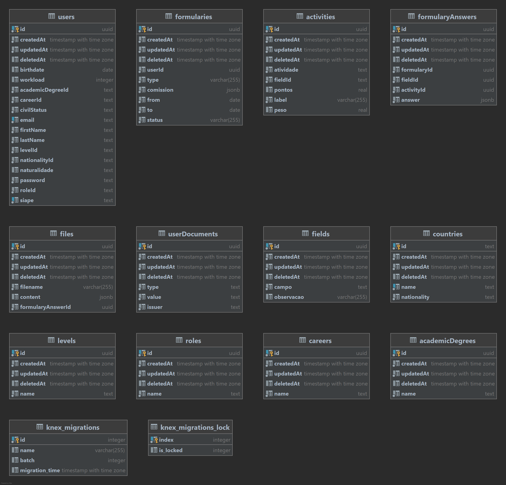

# Progressão Acadêmica

## Tecnologias

---

- NodeJs
- Typescript
- Postgres
- Knex
- Docker

## How To

---

Para executar o projeto é necessário que tenha instalado em sua máquina o Docker e o NodeJS.

- Crie um arquivo novo `.env` contendo:

```
ENVIRONMENT=local
DB_HOST=localhost
DB_USERNAME=postgres
DB_PASSWORD=postgres
DB_DATABASE=example
DB_PORT=5432
DB_LOGGING=true
PORT=8000
JWT_SECRET=boloDeMulango
SMTP_TRANSPORT_URL=
```

- Após clonar o projeto em sua máquina, é necessário primeiramente realizar a instalação das dependências:
 ```
 npm i // ou npm ci
 ```

- Realizaremos a subida do banco:
 ```
 npm run postgres:start
 npm run database:create
 ```

- Após isso já é possível rodarmos o projeto através do:

```
npm run dev
```

## Sobre

---
### Database Diagram



## Routes
---

| Route           	| Method 	| Action                                                            	|
|-----------------	|--------	|-------------------------------------------------------------------	|
| /academicDegree 	| GET    	| Obtain all Academic Degrees from database                         	|
| /career         	| GET    	| Obtain all Careers from database                                  	|
| /level          	| GET    	| Obtain all Levels from database                                   	|
| /nationality    	| GET    	| Obtain all nationalities from database                            	|
| /roles          	| GET    	| Obtain all roles from database                                    	|
| /users          	| POST   	| Create an user                                                    	|
| /login          	| POST   	| Login at the application                                          	|
| /field          	| POST   	| Create a Field for use at the Formulary                           	|
| /activity       	| POST   	| Create an Activity associated to a Field for use at the Formulary 	|
| /fields         	| GET   	| Obtain all fields from database                                   	|
| /formulary       	| POST   	| Create a Formulary at Database                                    	|


## Detailed Instructions

---

**/academicDegree - GET**

Response Body:

```js
[
  {
    "id": "e8d94522-94a9-4b59-8e9c-74b75c6de76b",
    "createdAt": "2021-08-22T20:58:06.441Z",
    "updatedAt": "2021-08-22T20:58:06.441Z",
    "deletedAt": null,
    "name": "Mestre"
  }
]
```

**/career - GET**

Response Body:

```js
[
  {
    "id": "16ce5b6b-25cd-48e6-9508-5c9583e4c521",
    "createdAt": "2021-08-22T20:58:06.441Z",
    "updatedAt": "2021-08-22T20:58:06.441Z",
    "deletedAt": null,
    "name": "Magistério Superior"
  }
]
```

**/level - GET**

Response Body:

```js
[
  {
    "id": "2b1631aa-e98b-4a66-904a-f40967f905b5",
    "createdAt": "2021-08-22T20:58:06.441Z",
    "updatedAt": "2021-08-22T20:58:06.441Z",
    "deletedAt": null,
    "name": "A"
  }
]
```

**/nationality - GET**

Response Body:

```js
[
  {
    "id": "AFG",
    "createdAt": "2021-08-22T20:58:06.441Z",
    "updatedAt": "2021-08-22T20:58:06.441Z",
    "deletedAt": null,
    "name": "Afeganistão",
    "nationality": "Afegão"
  }
]
```

**/roles - GET**

Response Body:

```js
[
  {
    "id": "e362357f-f9f6-4e62-a905-7d2b721fc13b",
    "createdAt": "2021-08-22T20:58:06.441Z",
    "updatedAt": "2021-08-22T20:58:06.441Z",
    "deletedAt": null,
    "name": "Professor Auxiliar"
  }
]
```

**/fields - GET**

Response Body:

```js
[
  {
    "id": "e362357f-f9f6-4e62-a905-7d2b721fc13b",
    "createdAt": "2021-08-22T20:58:06.441Z",
    "updatedAt": "2021-08-22T20:58:06.441Z",
    "deletedAt": null,
    "name": "Professor Auxiliar"
  }
]
```

**/users - POST**

Request Body:

```js
{
  academicDegreeId: academicDegree.id, // id do grau academico
  birthdate: Date | null, // data de aniversario, nulavel
  careerId: career.id, // id da carreira
  civilStatus: "Single" || "Married" || "Divorced" || "Widowed",
  email: string,
  firstName: string,
  lastName: string,
  levelId: string, // id do nivel correspondente
  nationalityId: nationality.id, // id da nacionalidade
  naturalidade: string | null, // nulavel
  password: string,
  roleId: role.id, // id do papel exercido
  siape: string,
  workload: number | null; // carga horaria de trabalho
}
```

Response Body:

```js
{
  id: "2b1631aa-e98b-4a66-904a-f40967f905b5" // userId
}
```

**/login - POST**

Request Body:

```js
{
  email: string,
  password: string
}
```

Response Body:

```js
{
  token: token // token de login -> deve ser passado no header como x-access-token para toda requisição que necessite de autenticação
}
```

**/formulary - POST**

Request Body:

```js
{
  type: "Progressao" || "Promocao", // tipo do formulario
  period: { // periodo do formulario
    from: Date,
    to: Date,
  },
  comission: [{
    professorName: string, // nome do professor na comissao
    department: string, // noem do departamento
    institute: string, // nome do instituto
  }],
  answers: [{
    fieldId: field.id, // id do campo referente
    activityId: activity.id, // id da atividade contida no campo
    answer: [{
        semester: string, // semestre equivalente aquela nota, EX: 2020.1
        points: number, // pontos para aquele semestre, EX: 2
    }],
  }];
}
```